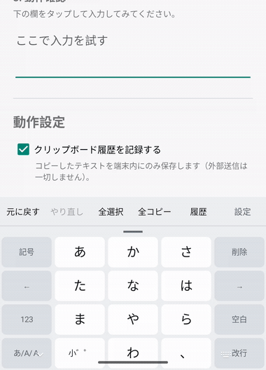
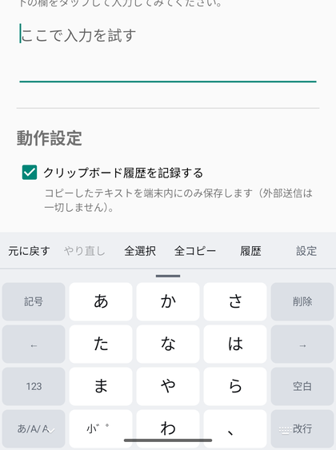
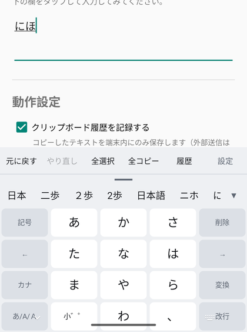
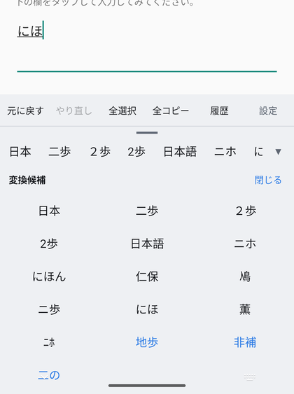

# フリックIME (FlickIME)

Android 用の日本語フリック入力キーボード。Windows の `Win+V`（クリップボード履歴）と
`Ctrl+Z` / `Ctrl+Y`（元に戻す・やり直し）に相当する機能をキーボード上に載せている。
UI は一般的なフリック入力方式（指を置いたキーを離すまで固定し、十字のポップアップで候補を示す）を採用している。

## 使用イメージ

「にほん」と入力して変換候補から「日本」を選び、ツールバーの「全選択」で全文を選択するまでの操作。



| キーボード | 変換候補 | 候補の一覧表示 |
| --- | --- | --- |
|  |  |  |
| 左列が `記号` `←` `123` `あ/A/Ａ`、右列が `削除` `→` `空白` `改行` | 入力するそばから候補が出る。青字は誤フリックを想定した校正候補とユーザー辞書の語 | 候補欄の右端の `▼` でキーボード領域いっぱいに広げ、全候補から選べる |

## 機能

| 機能 | 実現方法 |
| --- | --- |
| フリック入力 | ケータイ配列 4×5。指を置いたキーを固定し、移動方向で文字を決定。連打で文字送りも可能 |
| かな / 英字 / 数字 / 記号 | 左下の `あ/A/Ａ` キーで ひらがな→半角英字→全角英字 を巡回。左上の `記号` キーで記号パレット |
| カーソル移動 | 左列と右列の `←` `→` キー。長押しで連続移動 |
| 濁点・半濁点・小文字 | `小゛゜` キー。タップで巡回（は→ば→ぱ）、左フリックで゛、右フリックで゜ |
| カタカナ / 半角カタカナ変換 | かなモードの空白キーを上フリック。直前の語を ひらがな→カタカナ→半角カタカナ で巡回 |
| **かな漢字変換** | `あ/A/Ａ` キーを上フリックしてオン/オフ。オン中は Mozc エンジンに読みを送り、候補ストリップから選択・確定できる |
| **変換候補の一覧表示** | 候補欄の右端の ▼ でキーボード領域いっぱいにグリッド展開し、全候補から選べる |
| **誤フリックの校正候補** | フリックの押し間違いを想定した読みも裏で変換し、青字の校正候補として候補ストリップに並べる（例:「てすのした」→「テストした」） |
| **123 / カナ キー** | 左列の下から2番目。通常は `123` ⇄ `１２３`（半角/全角の数字レイアウト）、変換中は `カナ`（未確定文字列をカタカナに変換）。上フリックで他の IME へ切り替え |
| **文節の分割・移動** | 変換中に表示される `変換` キーのフリック。左右で文節の移動、上下で文節の区切りの伸縮 |
| **ユーザー辞書** | 設定画面の「ユーザー辞書を編集」。読みつきで登録した語が、前方一致で変換候補の先頭に出る |
| 単語単位の削除 | `削除` キーを左フリック。変換中なら未確定文字列ごと、そうでなければ直前の1単語を消す |
| 片手モード | `記号` キーを上フリック。オフ→左寄せ→右寄せ→オフの順に、キー配列全体の幅を縮めて片側に寄せる |
| キーボード高さ調整 | ツールバー直下のハンドルを上下ドラッグ。設定画面のスライダーとも連動 |
| クリップボード履歴 | ツールバーの「履歴」。コピーを検知して端末内に保存し、タップで貼り付け。★で固定。Android 13+ の機微なコピー(パスワードマネージャ等)は自動的に除外 |
| **すべて選択 / すべて選択してコピー** | ツールバーの `全選択` `全コピー`。コピーした内容はクリップボード履歴にも入る |
| 元に戻す / やり直し | ツールバーのボタン、および物理キーボードの `Ctrl+Z` / `Ctrl+Shift+Z` / `Ctrl+Y` |
| 履歴パネルのショートカット | 物理キーボードの `Ctrl+Shift+V` |

## ビルド

必要なもの:

- JDK 17
- Android SDK (compileSdk 35 / build-tools)
- Gradle 8.9 以上（または Android Studio）

Gradle Wrapper の jar は `gradle/wrapper/gradle-wrapper.jar` としてリポジトリに含まれているため、
`gradle wrapper` を自分で実行する必要はない。

```powershell
.\gradlew.bat assembleDebug
.\gradlew.bat testDebugUnitTest
.\gradlew.bat installDebug   # 端末を USB 接続 or エミュレータ起動中
```

SDK の場所は `local.properties` に書く（Android Studio なら自動生成される。パスは
`sdk.dir=C:/Users/<user>/AppData/Local/Android/Sdk` のようにスラッシュ区切りで）。

### APK サイズと ABI 別ビルド

Mozc の `libmozc.so` は ABI ごとに約13〜16MB、辞書データ `mozc.data` が約19MBあるため、
全ABI同梱のユニバーサルAPKは80MB超になる。サイドロード用に ABI 別の軽量APKも生成される
（`app/build.gradle.kts` の `splits.abi` 設定）。

```
app/build/outputs/apk/debug/
├── app-universal-debug.apk   # 全ABI同梱（互換性重視）
├── app-arm64-v8a-debug.apk   # 実機の主流ABI、約33MB
├── app-armeabi-v7a-debug.apk
├── app-x86_64-debug.apk      # エミュレータ用、約33MB
└── app-x86-debug.apk
```

エミュレータや実機のABIに合ったファイルを直接 `adb install` すればよい。
Play Store 経由で配布する場合は `bundleRelease` で App Bundle (.aab) を作れば、
端末のABIに合った分だけが自動的に配信される。

## 使い方

1. アプリを起動し、「入力方法の設定を開く」から **フリックIME** を有効化
2. 「キーボードを選択」で フリックIME に切り替え
3. 画面下部のテスト欄で入力を確認

## かな漢字変換 (Mozc) について

`app/src/main/jniLibs/*/libmozc.so` と `app/src/main/assets/mozc.data` は
[google/mozc](https://github.com/google/mozc)（BSD 3-Clause）を WSL2 + Bazel でビルドした成果物を
そのままリポジトリに同梱している。再ビルドする場合は WSL2 上で以下の手順を踏む。

```bash
git clone https://github.com/google/mozc.git && cd mozc/src
python3 build_tools/update_deps.py        # NDK 等を自動取得
bazelisk build package --config oss_android --config release_build
bazelisk build //data_manager/oss:mozc_dataset_for_oss --config release_build
bazelisk build //protocol:commands_java_proto_lite //protocol:candidate_window_java_proto_lite \
    //protocol:config_java_proto_lite //protocol:engine_builder_java_proto_lite \
    //protocol:user_dictionary_storage_java_proto_lite --config release_build
```

Windows ホストは非対応（NDK r29 ベースのビルドは macOS/Linux のみ）なので WSL2 が必須。
JNI 境界は `evalCommand(byte[]) -> byte[]`（`mozc.protocol.Command` のシリアライズ）
1本のみで、`KeyEvent.key_string` + `input_style=AS_IS` を使うことで、
このIMEが既に確定させたかな1文字をローマ字変換なしでそのまま未確定文字列として送り込める。
そのため既存のフリック入力ロジック（`FlickKeyboardView` / `KanaModifier`）はほぼそのまま流用し、
「確定した文字を `commitText` する代わりに Mozc セッションへ送る」という分岐を追加する形で統合した。

`com.google.android.apps.inputmethod.libs.mozc.session.MozcJNI`
というクラス名・パッケージ名は `libmozc.so` にコンパイル時に埋め込まれた JNI シンボルと
一致させる必要があるため変更できない。また Kotlin の `object`（インスタンスメソッドになる）ではなく
`companion object` + `@JvmStatic` で真の `static` ネイティブメソッドにする必要がある
（`object` のままだと `jclass has wrong type` で実行時クラッシュする）。

## 設計メモ・制限事項

Android は Windows と違い、**OS 全体で効くクリップボード履歴や undo は提供していない**。
そのため以下の方針で実装している。

- **クリップボード履歴**: Android 10 (API 29) 以降、バックグラウンドのアプリは
  クリップボードを読めない。ただし**既定の IME は例外**なので、IME として実装することで
  どのアプリでコピーしても履歴を蓄積できる。フリックIME が選択されていない間は記録されない。
  履歴は端末内（アプリ専用ディレクトリの `clips.json`）にのみ保存し、外部には送信しない。
  Android 13+ で `ClipDescription.EXTRA_IS_SENSITIVE` が立っているコピー
  （パスワードマネージャ等）は履歴に残さない。

- **元に戻す / やり直し**: OS 横断の undo は存在しないため、
  「この IME が `InputConnection` 経由で行った編集」だけを `EditHistory` に積んで打ち消す。
  他アプリ側の操作でテキストが変わっていた場合は、undo 実行時の照合で検知して履歴を破棄する
  （誤った文字を消さないため）。アプリ自身の undo（Google ドキュメント等）とは独立。
  Mozc で確定した変換結果も同じ `EditHistory` に記録されるため、undo/redo の対象になる。

- **かな漢字変換**: Mozc をオンにしている間は「打った文字を即 `commitText`」ではなく
  「Mozc セッションに送り、`setComposingText` で未確定文字列として表示 → 候補選択 or
  スペース/エンターキーで確定」という別の入力モデルに切り替わる。バックスペース・スペース・
  エンターは変換中は Mozc へそのまま転送し、状態遷移は Mozc 自身のセッション管理に任せている。

- **誤フリックの校正候補**: Mozc の `probable_key_event`（打鍵の確率つきヒント）は
  `InputStyle.AS_IS` でかなを直接送る本 IME の入力方式では効かず、また誤り訂正用の打鍵モデルも
  ビルドした `mozc.data` に含まれていない。そこで訂正は自前で行っている。

  打鍵ごとに「本当は隣のキー／別の方向だったかもしれない」候補を
  [`FlickAlternates`](app/src/main/java/com/example/flickime/keyboard/FlickAlternates.kt) で見積もり、
  未確定文字列と一緒に覚えておく。候補ストリップの更新時に、1文字だけ差し替えた読みを
  入力とは別の Mozc セッションで実際に変換し、その結果を校正候補として並べる。
  並び順は**変換後の文節数が少ない順**。一続きの語としてまとまって変換できた読みほど
  狙っていた語である可能性が高いという判断で、例えば「てすのした」に対しては
  「てすとした→テストした」(1文節) が「ねすのした→ネスの下」(2文節) より上に来る。

  問い合わせはバックグラウンドスレッドで行い、打鍵が続く間はデバウンスで間引く。
  ネイティブ側のセッションハンドラはスレッドセーフではないため `MozcEngine.eval` で直列化している。

- **変換セッションの消失**: 変換エンジンはセッションを内部で整理することがあり、
  消えたセッションへ送ったキーは「結果も未確定文字列も無い」応答として返る。これを
  「状態が変わらなかった」応答と取り違えると、打っても何も出ない状態から抜け出せなくなる。
  応答のエラーコードで見分け、表示中の未確定文字列は確定させたうえでセッションを作り直し、
  その打鍵を送り直している。

  校正候補を作る使い捨てセッションも、読みごとに作らず1つを使い回している。
  数が増えると変換エンジンの整理が走り、入力中のセッションを巻き添えにするため。

- **パスワード欄**: パスワード入力欄では、打った文字を変換エンジンに渡さない
  （Mozc の学習・予測に残さないため）。直接入力に切り替わる。

- **カタカナ変換**: 変換中の `カナ` キーは Mozc へ F7 を送っている。
  `SpecialKey.KATAKANA` はハードウェアのカタカナキー相当で入力モードを切り替えるだけで、
  未確定文字列は変換されない。

- **ユーザー辞書**: Mozc のユーザー辞書へは登録せず、変換候補を組み立てるときに
  こちら側で前方一致した語を先頭に足している。登録した語が必ず候補に出ることを保証しやすいため。
  確定は Mozc の候補選択ではなく文字列の直接確定で行う。

- **すべて選択 / コピー**: 自前で全文を取得して置き換えるのではなく、
  `InputConnection.performContextMenuAction` でテキスト操作のメニュー項目を
  アプリ側に実行してもらっている。選択や複写の実装はアプリごとに違うため、
  こちらで組み立てるより確実。

- **キー配列**: 左右の機能キーは、日本語フリック入力キーボードで一般的な並びにしている。
  左列が `記号` / `←` / `123` / `あ/A/Ａ`、右列が `削除` / `→` / `空白` / `改行`。
  設定画面はツールバーの「設定」から開くため、キーボード上に設定キーは置いていない。

  全角の英字・数字レイアウトは、半角のレイアウト表から文字キーの出力とラベルだけを
  全角に置き換えて生成している（`KeyLayouts.toFullWidth`）。同じ配列表を二重に持たずに済む。

- **変換候補の一覧表示**: 候補欄は横1行のスクロールなので、候補が多いと端が見えない。
  右端の ▼ でキーボード領域を覆うグリッドに展開し、全候補から選べるようにしている。
  Mozc へは入力セッションの作成時に `SET_REQUEST` で `mixed_conversion`（モバイル IME 向けの挙動）と
  広めの `candidate_page_size` を要求し、展開して選ぶだけの候補数を確保している。
  校正候補を作る使い捨てセッションには同じ要求を出していない。変換結果が変わると
  文節数による並び順の判断がぶれるため。

## 主なファイル

```
app/src/main/java/com/example/flickime/
├── FlickImeService.kt          IME 本体。キー処理・履歴・undo・Mozc統合の中心
├── SettingsActivity.kt         セットアップ手順と動作設定
├── Prefs.kt                    設定値
├── keyboard/
│   ├── KeySpec.kt              キー1つ分の定義とフリック方向
│   ├── KeyLayouts.kt           かな/英字/数字/記号の配列表
│   ├── KanaModifier.kt         濁点・半濁点・小文字の変換表
│   ├── KanaConverter.kt        ひらがな→カタカナ→半角カタカナの変換表
│   ├── FlickKeyboardView.kt    キーボードの描画・フリック判定・片手モード
│   ├── FlickAlternates.kt      押し間違いの次点候補の見積もり（純粋ロジック）
│   └── FlickGuideView.kt       フリック中の候補吹き出し
├── dict/
│   ├── UserDictionary.kt       ユーザー辞書の保存と前方一致検索
│   └── UserDictActivity.kt     ユーザー辞書の一覧・追加・削除
├── edit/EditHistory.kt         元に戻す / やり直しのスタック
├── clip/
│   ├── ClipboardStore.kt       履歴の保存（JSON）
│   └── ClipAdapter.kt          履歴一覧
└── mozc/
    ├── MozcEngine.kt           libmozc.so の初期化（辞書データの展開など）を担うシングルトン
    ├── MozcSession.kt          1回の変換セッション（CREATE_SESSION〜確定）のラッパー
    └── CandidateAdapter.kt     変換候補を展開表示したときのグリッド

app/src/main/java/com/google/android/apps/inputmethod/libs/mozc/session/
└── MozcJNI.kt                  libmozc.so への薄いJNIバインディング（クラス名固定）
```

## テスト

JVM 単体テストが 51 件ある（`./gradlew testDebugUnitTest`）。

- `FlickAlternatesTest` — 誤フリックの次点候補（隣キー・方向違い）の見積もり
- `KeyLayoutsTest` — 入力モードの巡回と、全角レイアウトの生成
- `UserDictionaryTest` — ユーザー辞書の前方一致と候補の並び順
- `KanaModifierTest` — 濁点・半濁点・小文字の巡回ロジック
- `KanaConverterTest` — カタカナ/半角カタカナ変換テーブル
- `EditHistoryTest` — undo/redo のマージ挙動、選択範囲削除、外部編集検知など
  （`InputConnection` は Mockito 委譲 + カーソル位置つきの実バッファでフェイク化）

## ライセンス

このリポジトリ自体のコードは [MIT License](LICENSE) の下で公開している。

ただし `app/src/main/jniLibs/*/libmozc.so`、`app/src/main/assets/mozc.data`、
および `app/libs/*.jar`（Mozc の protobuf 定義）は
[google/mozc](https://github.com/google/mozc) 由来で BSD 3-Clause License の下にある。
これらのビルド成果物を再配布する場合は Mozc 側のライセンス表示義務が別途かかる。
